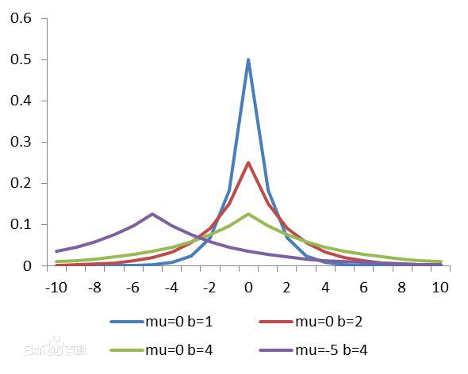

# Residual

## The Goal of Machine Learning

For a certain kind of event having a certain input and outcome, we would like to find a certain method to somehow predict the outcome before the inoput ever takes place. For this operation to be possible, the predicting event or model must follow a certain law of nature and the law somehow remains constant in a short period of time. Otherwise, for a entirely random system, it is, by itself, impossible to predict.

In order to actually make prediction valid and possible, we tend to look for the mathematical principle under the surface of each events. Namely, how are the variables effecting each other. The ideal model we can never get is that the output of the model can perfectly describe the outcome of the actual event under the same condition. Hence, we want the differences between our model and the real world to be as little as possible.

### Loss Function

As is mentioned above, we would want the differences between the real world and our model. To illustrate differences in Math, it is namely:

$$
\sum_{i=0}^NDistance(y_i,\hat{y}_i)\quad or \quad  Distance(y,\hat{y})
$$

The process of machine learning or any other means of modeling is to find the minimum value of the expression above. There are many ways to describe the distance of 2 matrices. One, for certain, the simple sum of subtractions between the 2 matrices is not a valid way, because the subtractions may be positive or negative and cancel out each other while taking sum. In other word, **the distance has to be always positive**. Following this thread of thoughts, we have 2 kinds of distance representation, L1 and L2.

$$
\sum_{i=0}^N(y_i-\hat{y}_i)^2\quad or\quad \sum_{i=0}^N|y_i-\hat{y}_i|
$$

Other ideas can be holding larger exponent, Ln. The function describing the distance is called the loss function. In the following paragraphs, Loss Function will be noted as $$J()$$ .

### Probability Explaination of Residual

In the previous paragraphs, it is explained how Residual is intuitively or logically right. In fact, Residual is stricted derived by probability theory. Let us presume that the sample we collected has a certain noise with Normal Distribution, that is, white noise.

$$
y=f(x)+\epsilon,\epsilon\sim N(0,\sigma^2),y|_{x_i}\sim N(f(x),\sigma^2)
$$

Maximum Likelihood Approximation:

$$
p(y|x_i)=\frac{1}{\sqrt{2\pi\sigma}}e^{-\frac{(y-f(x_i))^2}{2\sigma^2}}
$$

$$
l=\ln\prod_{i=1}^Np(y_i|x_i)=\ln\prod_{i=1}^N\frac{1}{\sqrt{2\pi\sigma}}e^{\frac{(y_i-f(x_i))^2}{2\sigma^2}}=N\ln\frac{1}{\sqrt{2\pi\sigma}}-\ln 2\sigma^2-\sum_{i=1}^N(y_i-f(x_i))^2
$$

Obviously, when L2 loss gets minimum value, we have a maximum likelihood approximation. Same thing goes for L1 and Ln. The standard of choosing the type of loss function is to look at the distribution that the noise might have. For L1:

$$
l=\ln\prod_{i=1}^Np(y_i|x_i)=\ln\prod_{i=1}^N\frac{1}{2b}e^{\frac{|y_i-f(x_i)|}{b}}=N\ln\frac{1}{2b}-\ln b-\sum_{i=1}^N|y_i-f(x_i)|
$$

